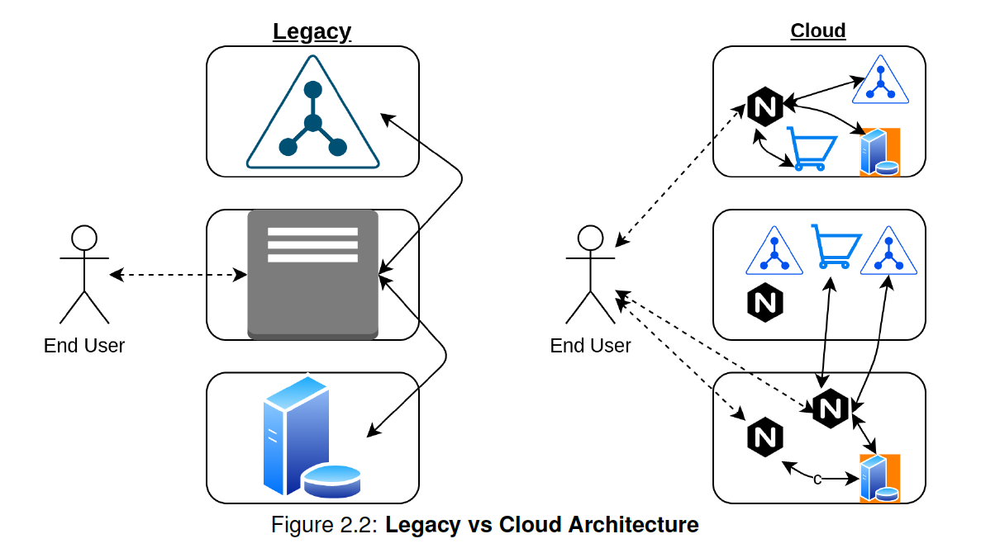
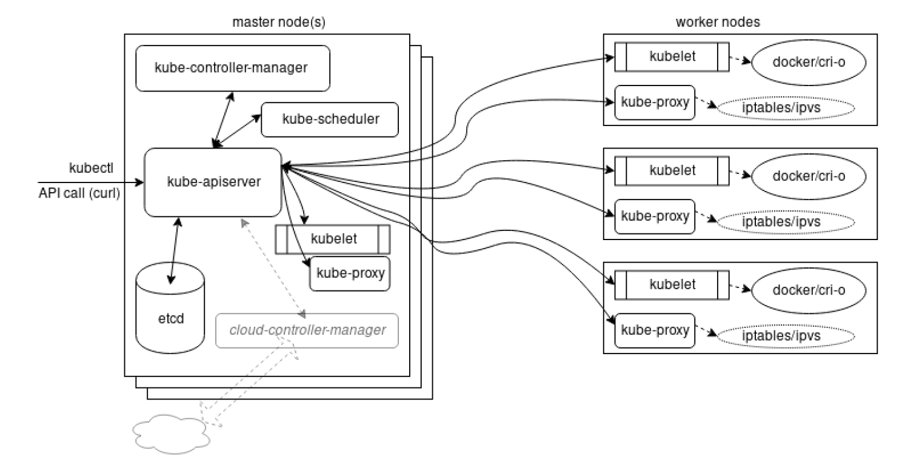
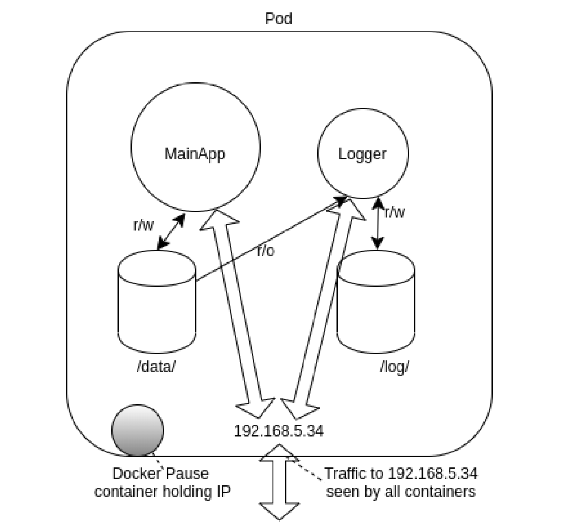
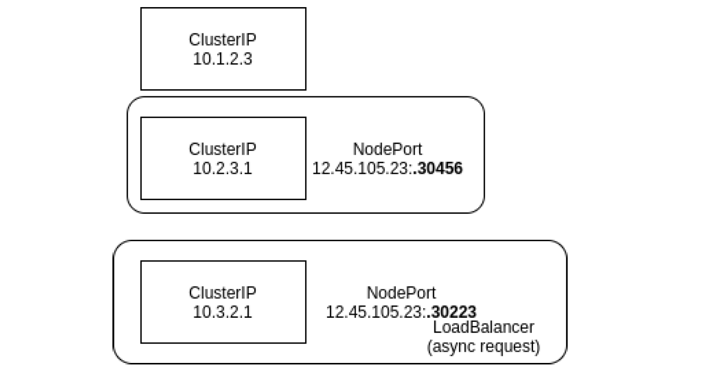
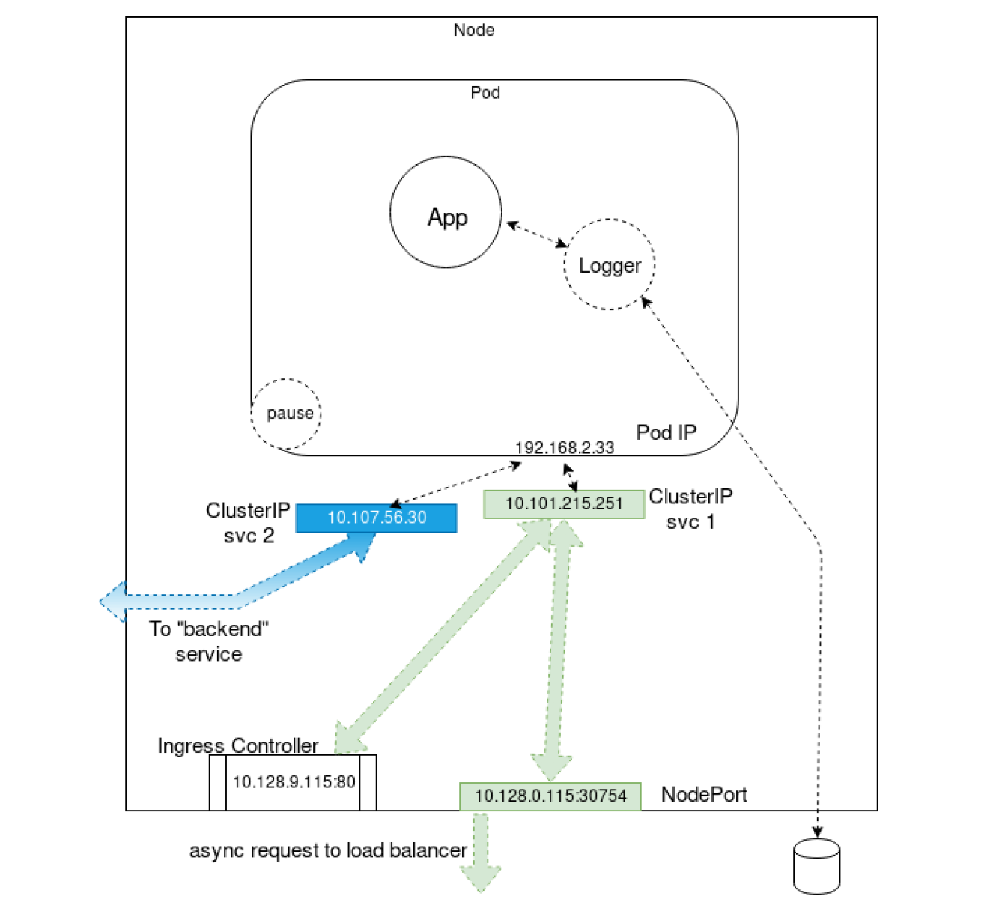
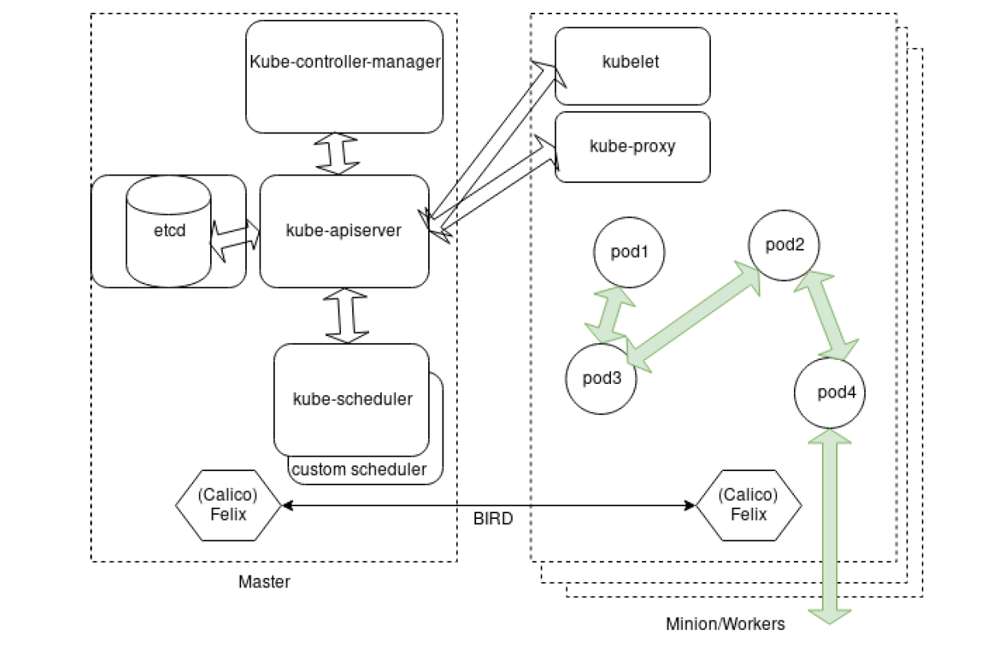

# Chapter 1 - Kubernetes architecture

### 1. What is Kubernetes?

- Running a container on a laptop is relatively simple. Deploying and connecting containers across multiple hosts, scaling them, deploying applications without downtime, and service discovery among several aspects can be complex.

 - *Notes*: We are working with Legos, not a model airplane. We are not getting a "COST" all-included product/platform. Instead we need to build.

- Kubernetes addresses those challenges from the start with a set of primitives and a powerful open and extensible API.
The ability to add new objects and operators allows easy customization for various production needs. The ability to add
multiple schedulers and multiple API servers adds to this customization.
- According to the https://kubernetes.io website, Kubernetes is:
`“an open-source system for automating deployment, scaling, and management of containerized applications”`
 - *Notes*: Kubernetes is orchestration software for automating deployment, scaling and mananaging containerized applications - offering Flexibility, Durability.

- A key aspect of Kubernetes is that it builds on 15 years of experience at Google in a project called Borg.
- Google’s infrastructure started reaching high scale before virtual machines became pervasive in the datacenter, and containers provided a fine-grained solution for packing clusters efficiently. Efficiency in using clusters and managing distributed applications
has been at the core of Google challenges.

- In Greek, `knbernhthV` means the Helmsman, or pilot of the ship. Keeping with the maritime theme of Docker containers, *Kubernetes is the pilot of a ship of containers*. Due to the difficulty in pronouncing the name, many will use a nickname, `K8s`, as Kubernetes has eight letters between K and S. The nickname is said like Kate’s.

- Kubernetes can be an integral part of Continuous Integration/Continuous Delivery (CI/CD), as it offers many of the necessary components.
 - Continuous Integration - A consistent way to build and test software. Deploying new packages with code written each day, or every hour, instead of quarterly. Tools like Helm and Jenkins are often part of this with Kubernetes.
 - Continuous Delivery - An automated way to test and deploy software into various environments. Kubernetes handles the life cycle of containers and connection of infrastructure resources to make rolling updates and rollbacks
easy, among other deployment schemes.
 - There are several options and possible configurations when building a CI/CD pipeline. Tools such as Jenkins, Spinnaker, GitHub, GitLab, and Helm among others may be part of your particular pipeline.

  - *Notes*: Here is a pipeline typical flow: `Developer -> Jenkins -> Spinaker -> Helm -> Kubernetes`
  - *Notes*: solarwinds hack: someone took control of Jenkins. the SW took out the code pushed via Jenkins.
  - *Notes*: all the tools/code we use in lab, we can use it after the course to build our own cluster.

### 2. Components of Kubernetes
  - *Notes*: K8s is NOT another VM deployment tool. **Hardest part is writing proper code**, not Kubernetes

  - *Notes*: if we work for a large company and have a lot of legacy code, this is hard. Getting a K8s cluster up and running is easy. **Optimizing the code for K8s in more cases than not is NOT easy**. To note in our case (MLaaS), this may not be as hard as we already have containerzied our app as micro-services.

  - *Notes*: Key is that our micro-services need to be `transient` and `decoupled`. They need to be as small as reasonable - per task or function to be completed.
  - `microservice` - as small as reasonable - per task or function to be completed
  - `transient` - write all images with expectation that they be terminated any time and all the time. Can you use Chaos Monkey in production?
  - `decoupled` - least number of images possible. Changes should take place in secrets and configMaps.

  ==> We need to manage a small number of images. We want small/lean/transient micro-services so that transient changes (IP addresses, users, key rotating,...) are easy to apply and we don't need a new image for it.

- Developers new to Kubernetes sometimes assume it is another `virtual-machine` manager, similar to what they have been using for decades and continue to develop applications in the same way as prior to using Kubernetes. **This is a mistake**. The decoupled, transient, microservice architecture is not the same. Most legacy applications will need to be rewritten to optimally run in a cloud. In this diagram we see the legacy deployment strategy on the left with a monolithic applications deployed to nodes. On the right we see an example of the same functionality, on the same hardware, using
multiple microservices.

- Communication to, as well as internally, between components is API call-driven, which allows for flexibility. Configuration
information is stored in a JSON format, but is most often written in YAML. Kubernetes agents convert the YAML to JSON
prior to persistence to the database.

### challenges
- Containers have seen a huge rejuvenation. They provide a great way to package, ship, and run applications - that is the `Docker` motto, now provided by many tools.
- The developer experience has been boosted tremendously thanks to containers. Containers, and Docker specifically, have empowered developers with ease of building container images, simplicity of sharing images via registries, and
providing a powerful user experience to manage containers. Now several tools such as `Buildah`, `Podman`, `cri-o`, `containerd`, `frakti`, and others allow for easy container creation and management.
- However, managing containers at scale and architecting a distributed application based on microservices’ principles is still challenging.
- You first need a continuous integration pipeline to build your container images, test them, and verify them. Then, you need a cluster of machines acting as your base infrastructure on which to run your containers. You also need a system to launch your containers, and watch over them when things fail and self-heal. You must be able to perform rolling updates and rollbacks, and eventually tear down the resource when no longer needed.
- All of these actions require flexible, scalable, and easy-to-manage network and storage. As containers are launched on any worker node, the network must join the resource to other containers, while still keeping the traffic secure from others. We also need a storage structure which provides and keeps or recycles storage in a seamless manner.

  - *Notes*: Would users notice if you ran **Chaos Monkey**, which terminates any container randomly? If so you may have more work making containers and applications more decoupled and transient.

  ### Kubernetes architecture

  - To quickly demystify Kubernetes, let’s have a look at a Kubernetes architecture graphic, which shows a high-level architecture
  diagram of the system components.:

  

- In its simplest form, Kubernetes is made of one or more central managers (aka `master`) and `worker` nodes (we will see in a follow-on chapter how you can actually run everything on a single node for testing purposes). The manager runs an API server, a scheduler, various operators and a datastore to keep the state of the cluster, container settings, and the networking configuration.
- Kubernetes exposes an API via the API server: you can communicate with the API using a local client called `kubectl` or you can write your own client. The kube-scheduler sees the API requests for running a new container and finds a
suitable node to run that container. Each node in the cluster runs two containers: `kubelet` and `kube-proxy`. The kubelet container receives spec information for container configuration, downloads and manages any necessary resources and works with the container engine on the local node to ensure the container runs or is restarted upon failure. The kubeproxy container creates and manages local firewall rules and networking configuration to expose containers on the network.

  - *Notes*: `operator`, also called `controller` or `watch-loop` - spec and status asked for over and over. Constantly making request to know what is the `spec` and what is the `status`. If spec and status don't match, I will change. For ex, we expect 2 to run, but we are 4 - kill 2. or maybe 1 only is running - start 1. `spec` and `status` are stored in `etcd`

  - `etcd` - it's a DB that stores the state of the cluster. The one thing you cannot lose. Not for end user storage.

  - `kube-apiserver` handles all API calls - it's the only pod which talks to `etcd`. While we can interact with it, usually in large companies, we leverage a pipeline to interact with it.

  - `kube-controller-manager`: the "brain" where all the shipped operators run

  - `kubelet` - a service, not a pod, run by systemctl, which mounts volumes, downloads stuff, checks network then tells Docker/Cri-o what to do. The kubelet agent is the heavy lifter for changes and configuration on worker nodes. It accepts the API calls for Pod specifications (a PodSpec is a JSON or YAML file that describes a pod). It will work to configure the local node until the specification has been met.

  - `kube-proxy` - a pod which handles iptables and works with network plugin (calico)

  - `Deployment` - an operator which watches replicaSets.

  - `replicaSet` - an operator which ensures some number of replicas are running. A replica is a pod using the same podspec

  - `pod` - one or more containers which share a single IP, access to storage, and a common network namespace. Containers in a Pod are started in parallel by default. There is only one IP address per Pod. While **Pods are often deployed with one application container in each**, a common reason to have multiple containers in a Pod is for logging. You may find the term `sidecar` for a container dedicated to performing a helper task, like handling logs and responding to requests, as the primary application container may have this ability. Pods, and other objects, can be created in several ways. They can be created by using a generator, which historically has changed with each release: `kubectl run newpod --image=nginx --generator=run-pod/v1`. Or they can be created and deleted using a properly formatted JSON or YAML file: `kubectl create -f newpod.yaml` and `kubectl delete -f newpod.yaml`

  - `DaemonSet` - one pod per node, metrics, security, logging...

  - `StatefulSet` - organized deployment of dissimilar pods - legacy app - F1 car on a tow truck

  - `Job` - operator to run one or more pods, sometimes in parallel

  - `Cronjob` - an operator which watches the job operator and the current time to the minute

  - `service`, `endpoint`  - ip traffic to the pods ephemeral IP. Service operator watches the endpoint operator. The endpoint operator gets pod IPs and updates the service

  - `kube-scheduler` - uses an algorithm to determine which node will host a Pod of containers.  It usually a pod-count but complex configuration can be done. Can use `taints and tolerations` - for example, using a strong `gpu` to taint a node. up to the pod spec via toleration to assign pods to particular nodes.

  - `worker` nodes: run the `kubelet` and `kube-proxy` as ewll as container engine such as `Docker` or `cri-o`.
  - Cluster-wide metrics is not quite fully mature, so Prometheus (https:/Prometheus.io) is also often deployed to gather metrics from nodes and perhaps some applications.

  - `singe IP per pod`: A pod represents a group of co-located containers with some associated data volumes. All containers in a pod share the same network namespace. The diagram below shows a pod with two containers, MainApp and Logger, and two data volumes, made available under two mount points. Containers MainApp and Logger share the network namespace of a third container, known as the pause container. The pause container is used to get an IP address, then all the containers in the pod will use its network namespace. You won’t see this container from the Kubernetes perspective, but you would by running sudo docker ps. The volumes are shown for completeness and will be discussed later.

  - `networking setup`: A detailed explanation about the Kubernetes networking model can be seen on the Cluster Networking page in the Kubernetes documentation at https://kubernetes.io/docs/concepts/cluster-administration/networking. If you have experience deploying virtual machines (VMs) based on IaaS solutions, this will sound familiar. The only caveat is that, in Kubernetes, the lowest compute unit is not a `container`, but what we call a `pod`. A pod is a group of co-located containers that share the same IP address. From a networking perspective, a pod can be seen as a virtual machine of physical hosts. The network needs to assign IP addresses to pods, and needs to provide traffic routes between all pods on any nodes.
  - Kubernetes expects the network configuration to enable pod-to-pod communications to be available; it will not do it for you. Pods are assigned an IP address prior to application containers being started. The service object is used to connect pods within the network using ClusterIP addresses, from outside of the cluster using NodePort addresses, and using a load balancer if configured with a LoadBalancer service.
  - A `ClusterIP` is used for traffic within the cluster. A `NodePort` first creates a ClusterIP then associates a port of the node to that new ClusterIP. If you create a LoadBalancer service it will first create a ClusterIP, then a NodePort and then make an asynchronous request for an external load balancer. If one is not configured to respond the EXTERNAL-IP will remain in pending state for the life of the service.

  - *Notes*:
  - `ClusterIP` - inside the cluster more permenant IP
  - `NodePort` - creates a ClusterIP, then associates a high number port to it
  - `LoadBalancer` - creates a NodePort, async request to USE a loadbalancer. Does not create one

- An `Ingress Controller` or a service mesh like `Istio` can also be used to connect traffic to a pod. This image shows a multi-container pod, two services with one for internal traffic only, and a an ingress controller. The sidecar container, acting as a logger, is shown writing out storage, just to show a more complete pod. The pause container, which is only used to retrieve the namespace and IP address is also shown.

- Another possible view of a cluster with multiple pods and services. This graphic shows the `Calico` pod running on each node and communicating with the BIRD protocol. There are also three `ClusterIP` services and on `LoadBalancer` service trying to show how the front end may communicate with other pods. The pods could have been on any worker, and are shown on one only as an example. Note this graphic is not an expansion of the previous graphic.

Tim Hockin, one of the lead Kubernetes developers, has created a very useful slide deck to understand the Kubernetes
networking An Illustrated Guide to Kubernetes Networking at
https://speakerdeck.com/thockin/illustrated-guide-to-kubernetes-networking

  - `Pod-to-pod Communication` : While a CNI plugin can be used to configure the network of a pod and provide a single IP per pod, CNI does not help
you with pod-to-pod communication across nodes. The early requirement from Kubernetes was the following:
   – All pods can communicate with each other across nodes.
   – All nodes can communicate with all pods.
   – No Network Address Translation (NAT).
Basically, all IPs involved (nodes and pods) are routable without NAT. This can be achieved at the physical network
infrastructure if you have access to it (e.g. GKE). Or, this can be achieved with a software defined overlay with solutions like:
– Weave: https://www.weave.works/oss/net/

– Flannel: https://github.com/coreos/flannel#flannel

– Calico: https://www.projectcalico.org/

– Romana: https://romana.io/
Most network plugins now support the use of `Network Policies` which act as an internal firewall, limiting ingress and egress traffic.
See the cluster networking documentation page (https://kubernetes.io/docs/concepts/cluster-administration/networking/) or the list of networking add-ons (https://kubernetes.io/docs/concepts/cluster-administration/addons/ for a more complete list.

 - *Notes*:  Calico is great for everything but very very large clusters. In the 4 to 5k nodes range, amount of traffic becomes in the way. For really large cluster, use a different plugin.

 - `Cloud Native Computing Foundation`: Kubernetes is an open source software with an Apache license. Google donated Kubernetes to a newly formed collaborative project within the Linux Foundation in July 2015, when Kubernetes reached the v1.0 release. This project is known as the **Cloud Native Computing Foundation (CNCF).**
 
