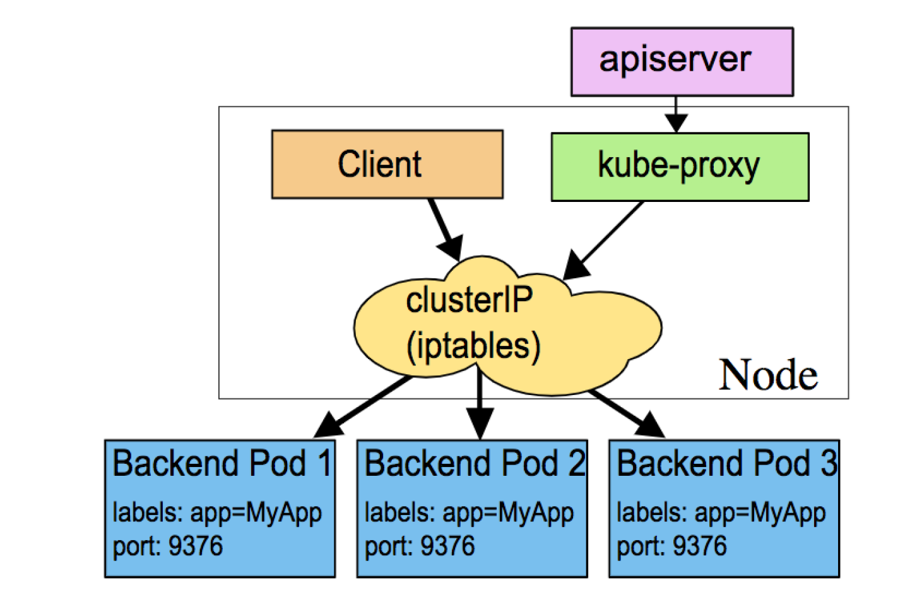
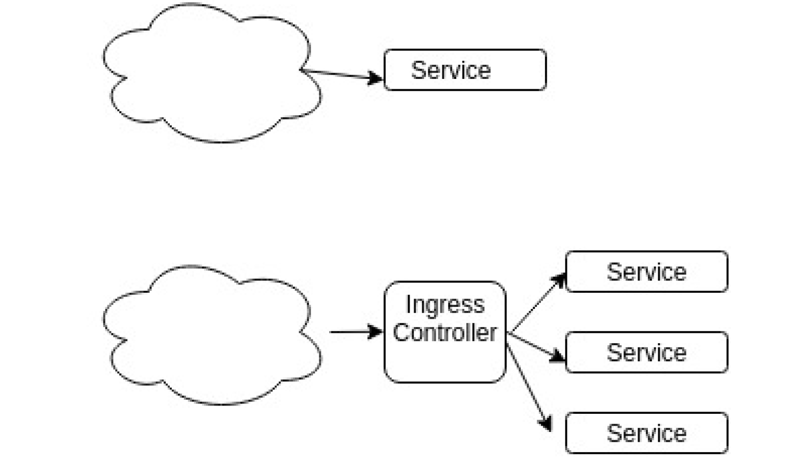

# Chapter 10 Kubernetes - Exposing Applications

In this chapter, we are going to talk about exposing our applications using services. We’ll start by talking about a `ClusterIP`
service. This allows us to expose our application inside of the cluster only. A `NodePort` will create a ClusterIP and then also,
get a high number port from the node. This allows us then to expose our applications internally on a low number port, and
externally, but only on a high number port. The use of a `LoadBalancer` first creates a NodePort on our behalf. The difference is
it also sends an asynchronous request to a cloud provider to make use of a LoadBalancer. If we are not using a cloud provider,
or if a load balancer is not available, it continues to run as a NodePort. The fourth service that we are going to discuss is
called `ExternalName`. This is useful for handling requests to an outside DNS resource, instead of one inside of the cluster.
This is helpful if you were in the process of moving your application from outside of the cluster inside. We’ll also discuss the
configuration of an Ingress Controller. The two reasons that you might want to use an Ingress Controller is, for example, if
you have thousands of services, having them independent can become difficult to manage, and wasteful of resources. You
can then consolidate it to a single Ingress Controller. Or multiple Ingress Controllers if you want more flexibility. The second
reason is an Ingress Controller allows you to expose a low numbered port to your application. Without that, you could get
there, but you’d have to use iptables, which could become difficult and not terribly flexible to manage.


#### 1 Service Types
- Services can be of the following types:
 - ClusterIP
 - NodePort
 - LoadBalancer
 - ExternalName

- The `ClusterIP` service type is the default, and only provides access internally (except if manually creating an external
endpoint). The range of ClusterIP used is defined via an API server startup option.
- The `NodePort` type is great for debugging, or when a static IP address is necessary, such as opening a particular
address through a firewall. The NodePort range is defined in the cluster configuration.
- The `LoadBalancer` service was created to pass requests to a cloud provider like GKE or AWS. Private cloud solutions
also may implement this service type if there is a cloud provider plugin, such as with CloudStack and OpenStack. Even
without a cloud provider, the address is made available to public traffic, and packets are spread among the Pods in the
deployment automatically.
- A newer service is `ExternalName`, which is a bit different. It has no selectors, nor does it define ports or endpoints. It
allows the return of an alias to an external service. The redirection happens at the DNS level, not via a proxy or forward.
This object can be useful for services not yet brought into the Kubernetes cluster. A simple change of the type in the
future would redirect traffic to the internal objects. As CoreDNS has become more stable this service is not used as
much.
- The `kubectl` proxy command creates a local service to access a ClusterIP. This can be useful for troubleshooting or
development work.


#### 2 Services Diagram
- The `kube-proxy` running on cluster nodes watches the API server service resources. It presents a type of virtual IP
address for services other than ExternalName. The mode for this process has changed over versions of Kubernetes.
- In v1.0, services ran in `userspace` mode as TCP/UDP over IP or Layer 4. In the v1.1 release, the `iptables` proxy was
added and became the default mode starting with v1.2.


- In the iptables proxy mode, `kube-proxy` continues to monitor the API server for changes in Service and Endpoint
objects, and updates rules for each object when created or removed. One limitation to the new mode is an inability to
connect to a Pod should the original request fail, so it uses a Readiness Probe to ensure all containers are functional
prior to connection. This mode allows for up to approximately 5000 nodes. Assuming multiple Services and Pods per
node, this leads to a bottleneck in the kernel.
- Another mode introduced in v1.9 and GA in v1.11 is `ipvs`. This mode works in the kernel space for greater speed, and
allows for a configurable load-balancing algorithm, such as round-robin, shortest expected delay, least connection and
several others. This can be helpful for large clusters, much past the previous 5000 node limitation. This mode assumes
IPVS kernel modules are installed and running prior to kube-proxy. Clusters built with kubeadm do not enable ipvs by
default, but this can be passed during cluster initialization.
- The kube-proxy mode is configured via a flag sent during initialization, such as mode=iptables and could also be IPVS
or userspace.

#### 3 Service Update Pattern
- Labels are used to determine which Pods should receive traffic from a service. Labels can be dynamically updated for
an object, which may affect which Pods continue to connect to a service.
- The default update pattern is for a rolling deployment, where new Pods are added, with different versions of an application,
and due to automatic load balancing, receive traffic along with previous versions of the application.
- Should there be a difference in applications deployed, such that clients would have issues communicating with different
versions, you may consider a more specific label for the deployment, which includes a version number. When the
deployment creates a new replication controller for the update, the label would not match. Once the new Pods have
been created, and perhaps allowed to fully initialize, we would edit the labels for which the Service connects. Traffic
would shift to the new and ready version, minimizing client version confusion.


#### 4 Accessing an Application with a Service
- The basic step to access a new service is to use `kubectl`:
```
$ kubectl expose deployment/nginx --port=80 --type=NodePort
$ kubectl get svc
NAME CLUSTER-IP EXTERNAL-IP PORT(S) AGE
kubernetes 10.0.0.1 <none> 443/TCP 18h
nginx 10.0.0.112 <nodes> 80:31230/TCP 5s
```

```
$ kubectl get svc nginx -o yaml
apiVersion: v1
kind: Service
...
spec:
 clusterIP: 10.0.0.112
 ports:
 - nodePort: 31230
...
9 Open browser http://<Public IP>:31230
```

- The `kubectl` expose command created a service for the nginx deployment. This service used port 80 and generated
a random port on all the nodes. A particular port and targetPort can also be passed during object creation to avoid
random values. The targetPort defaults to the port, but could be set to any value, including a string referring to a port
on a backend Pod. Each Pod could have a different port, but traffic is still passed via the name. Switching traffic to a
different port would maintain a client connection, while changing versions of software, for example.
- The kubectl get svc command gave you a list of all the existing services, and we saw the nginx service, which was
created with an internal cluster IP.
- The range of cluster IPs and the range of ports used for the random NodePort are configurable in the API server startup
options.
- Services can also be used to point to a service in a different namespace, or even a resource outside the cluster, such
as a legacy application not yet in Kubernetes.

#### 5 Service without a Selector
- Typically, a service creates a new endpoint for connectivity. Should you want to create the service, but later add the
endpoint, such as connecting to a remote database, you can use a service without selectors. This can also be used to
direct the service to another service, in a different namespace or cluster

*Notes:* services use a label to connect traffic to an endpoint. Pod label and selector must match

#### 6 ClusterIP
- For inter-cluster communication, frontends talking to back-ends can use `ClusterIPs`. These addresses and endpoints
only work within the cluster.
- ClusterIP is the default type of service created.
```
spec: clusterIP: 10.108.95.67 ports: - name: "443" port:
443 protocol: TCP targetPort: 443
```

#### 7 NodePort
- `NodePort` is a simple connection from a high-port routed to a ClusterIP using iptables, or ipvs in newer versions.
The creation of a NodePort generates a ClusterIP by default. Traffic is routed from the NodePort to the
ClusterIP. Only high ports can be used, as declared in the source code. The NodePort is accessible via calls to
`<NodeIP>:<NodePort>`.
```
spec:
 clusterIP: 10.97.191.46
 externalTrafficPolicy: Cluster
 ports:
 - nodePort: 31070
  port: 80
  protocol: TCP
  targetPort: 800a0
 selector:
  io.kompose.service: nginx
 sessionAffinity: None
 type: NodePort
```

#### 8 LoadBalancer
- Creating a `LoadBalancer` service generates a `NodePort`, which then creates a `ClusterIP`. It also sends an asynchronous
call to an external load balancer, typically supplied by a cloud provider. The External-IP value will remain in
a ``<Pending>`` state until the load balancer returns. Should it not return, the NodePort created acts as it would otherwise.
```
Type: LoadBalancer
loadBalancerIP: 12.45.105.12
clusterIP: 10.5.31.33
ports:
- protocol: TCP
 Port: 80
```
- The routing of traffic to a particular backend pod depends on the cloud provider in use.


#### 9 ExternalName
- The use of an ExternalName service, which is a special type of service without selectors, is to point to an external DNS
server. Use of the service returns a CNAME record. Working with the ExternalName service is handy when using a
resource external to the cluster, perhaps prior to full integration.
```
spec:
 Type: ExternalName
 externalName: ext.db.example.com
```
- DNS services are now handled by the kube-dns service which uses the `CoreDNS` image on kubeadm created clusters.
The CoreDNS service has many features in addition to being a DNS server, and is extensible using plugins. More can
be found here: https://coredns.io/manual/toc/


#### 10 Ingress Resource
- An ingress resource is an API object containing a list of rules matched against all incoming requests. Only HTTP rules
are currently supported. In order for the controller to direct traffic to the backend, the HTTP request must match both
the host and the path declared in the ingress.

#### Ingress Controller
- It's a pod, with specific capabilities to listen to port 80 and matches traffic to a service based on header.

- Handling a few services can be easily done. However, managing thousands or tens of thousands of services can create
inefficiencies. The use of an `Ingress Controller` manages ingress rules to route traffic to existing services. Ingress can
be used for fan out to services, name-based hosting, TLS, or load balancing. Another feature is the ability to expose
low-numbered ports. Services have been hard-coded not to expose ports lower than 1024.



- There are a few Ingress Controllers with nginx and GCE that are ”officially supported” by the community. Traefik
(pronounced ”traffic”) https://traefik.io/ and HAProxy https://haproxy.org are in common use, as well. More controllers
are planned, as is support for more HTTPS/TLS modes, combining L4 and L7 ingress and requesting name or IP via
claims.


*Notes*:
- `services` use a label to connect traffic to an endpoint. Pod label and selector must match. A service is NOT a listener, it is a pipe to connect to a pod.
- `ClusterIP` - IP address which persists, for traffic within the cluster
- `NodePort` - First creates a ClusterIP, then associates high number port using iptables/ipvs on all nodes
- `LoadBalancer` - Creates a NodePort, then makes async request to use an LB, if one responds
- `ingress controller` - special pod given ability to manage the host network to listen on port 80, which listens to port 80. 443, 8080 etc... and matches traffic to a service based on header


#### 12 Service Mesh
- For more complex connections or resources such as service discovery, rate limiting, traffic management and advanced
metrics you may want to implement a service mesh.
- A service mesh consists of edge and embedded proxies communicating with each other and handing traffic based on
rules from a control plane. Various options are available including Envoy, Istio, and linkerd.
 - `Envoy` - a modular and extensible proxy favored due to modular construction, open architecture and dedication to
remaining unmonitized. Often used as a data plane under other tools of a service mesh. https://www.envoyproxy.io
 - `Istio` - a powerful tool set which leverages Envoy proxies via a multi-component control plane. Built to be platform
independent it can be used to make the service mesh flexible and feature filled. https://istio.io
 - `linkerd` - Another service mesh purpose built to be easy to deploy, fast, and ultralight. https://linkerd.io/
