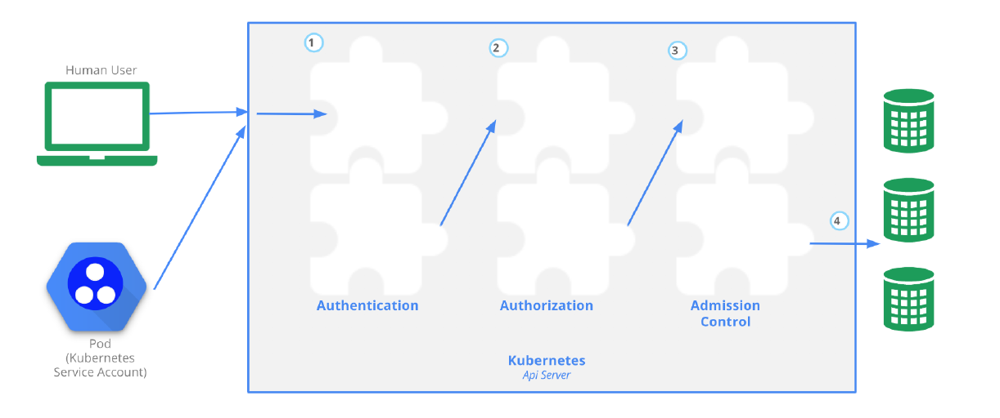

# Chapter 9 Kubernetes - Security

In this chapter, we are going to talk about how an API call is ingested into the cluster. We will go through the details of the
three different phases each call goes through. We’ll look at the different types of authentication that are available to us, and
work with RBAC, which handles the authorization on our behalf. We’ll also configure pod policies. The use of a pod policy
allows us to configure the details of what a container can do, and how processes run within that container.
We’ll finish by understanding a network policy. If the network plugin honors a network policy, this allows you to isolate a pod
from other pods in the environment. The default Kubernetes architecture says that all pods should be able to see all pods. So,
this is a change from that historic approach. But, as we use it in a production environment, you may want to limit ingress


#### 1 Security Overview
- Security is a big and complex topic, especially in a distributed system like Kubernetes. Thus, we are just going to cover
some of the concepts that deal with security in the context of Kubernetes.
- Then, we are going to focus on the authentication aspect of the API server and we will dive into authorization, looking
at things like ABAC and RBAC, which is now the default configuration when you bootstrap a Kubernetes cluster with `kubeadm`.
- We are going to look at the `admission control` system, which lets you look at and possibly modify the requests that are coming in, and do a final `deny` or `accept` on those requests.
- Following that, we’re going to look at a few other concepts, including how you can secure your Pods more tightly using
`security contexts` and `pod security policies`, which are full-fledged API objects in Kubernetes.
- Finally, we will look at `network policies`. By default, we tend not to turn on network policies, which let any traffic flow
through all of our pods, in all the different namespaces. Using network policies, we can actually define Ingress rules so
that we can restrict the Ingress traffic between the different namespaces. The network tool in use, such as Flannel or
Calico will determine if a network policy can be implemented. As Kubernetes becomes more mature, this will become a
strongly suggested configuration.

#### 2 Accessing the API
- To perform any action in a Kubernetes cluster, you need to access the API and go through three main steps:
 - Authentication
 - Authorization (ABAC or RBAC)
 - Admission Control.

- These steps are described in more detail in the official documentation at
https://kubernetes.io/docs/reference/access-authn-authz/controlling-access/ about controlling access to the API and illustrated by the picture below, from
https://kubernetes.io/docs/reference/command-line-tools-reference/kube-apiserver/:


- Once a request reaches the API server securely, it will first go through any `authentication` module that has been configured.
The request can be rejected if authentication fails or it gets authenticated and passed to the authorization step.
- At the `authorization` step, the request will be checked against existing policies. It will be authorized if the user has the
permissions to perform the requested actions. Then, the requests will go through the last step of `admission`. In general,
admission controllers will check the actual content of the objects being created and validate them before admitting the
request.
- In addition to these steps, the requests reaching the API server over the network are encrypted using `TLS`. This needs
to be properly configured using SSL certificates. If you use kubeadm, this configuration is done for you; otherwise, follow
Kelsey Hightower’s guide, Kubernetes The Hard Way at https://github.com/kelseyhightower/kubernetes-the-hard-way,
or the API server configuration options at https://kubernetes.io/docs/reference/command-line-tools-reference/kube-apiserver/.


#### 3 Authentication
- There are three main points to remember with authentication in Kubernetes:
 - 1. In its straightforward form, authentication is done with certificates, tokens or basic authentication (i.e. username and password).
 - 2. Users are not created by the API, but should be managed by an external system.
 - 3. System accounts are used by processes to access the API.
(https://kubernetes.io/docs/tasks/configure-pod-container/configure-service-account/)

- There are two more advanced authentication mechanisms: `Webhooks` which can be used to verify bearer tokens, and connection with an external `OpenID` provider.
- The type of authentication used is defined in the kube-apiserver startup options. Below are four examples of a subset
of configuration options that would need to be set depending on what choice of authentication mechanism you choose:
 - `--basic-auth-file`
 - `--oidc-issuer-url`
 - `--token-auth-file`
 - `--authorization-webhook-config-file`
- One or more Authenticator Modules are used: `x509` Client Certs; static token, bearer or bootstrap token; static password file; service account and OpenID connect tokens. Each is tried until successful, and the order is not guaranteed.
Anonymous access can also be enabled, otherwise you will get a 401 response. Users are not created by the API, and
should be managed by an external system.
- To learn more about authentication, see the official Kubernetes documentation at https://kubernetes.io/docs/reference/
access-authn-authz/authentication/.


#### 4 Authorization
- Once a request is authenticated, it needs to be authorized to be able to proceed through the Kubernetes system and
perform its intended action.
- There are three main authorization modes and two global Deny/Allow settings. The three main modes are:
 - 1. `ABAC`
 - 2. `RBAC`
 - 3. `WebHook`
- They can be configured as kube-apiserver startup options:
 - `--authorization-mode=ABAC authorization-mode=RBAC`
 - `--authorization-mode=Webhook`
 - `--authorization-mode=AlwaysDeny`
 - `--authorization-mode=AlwaysAllow`
- The authorization modes implement policies to allow requests. Attributes of the requests are checked against the policies
(e.g. user, group, namespace, verb).

#### 5 RBAC
- `RBAC` (https://kubernetes.io/docs/reference/access-authn-authz/rbac/) stands for Role Based Access Control.
- All resources are modeled API objects in Kubernetes, from Pods to Namespaces. They also belong to `API Groups`,
such as core and apps. These resources allow operations such as Create, Read, Update, and Delete (CRUD), which
we have been working with so far. Operations are called verbs inside YAML files. Adding to these basic components,
we will add more elements of the API, which can then be managed via RBAC.
- `Rules` are operations which can act upon an API group.
- `Roles` are a group of rules which affect, or scope, a single namespace, whereas `ClusterRoles` have a scope of the entire cluster.
- Each operation can act upon one of three subjects, which are `User Accounts` which don’t exist as API objects, `Service Accounts`, and `Groups` which are known as `clusterrolebinding` when using `kubectl`.
- **RBAC is then writing rules to allow or deny operations by users, roles or groups upon resources.**


#### 6 RBAC Process Overview
- While RBAC can be complex, the basic flow is to create a certificate for a user. As a user is not an API object of
Kubernetes, we are requiring outside authentication, such as OpenSSL certificates. After generating the certificate
against the cluster certificate authority, we can set that credential for the user using a context.
- Roles can then be used to configure an association of `apiGroups`, `resources`, and the `verbs` allowed to them. The
user can then be bound to a role limiting what and where they can work in the cluster.

- Here is a **summary of the RBAC process**:
 - Determine or create `namespace`
 - Create `certificate credentials` for user
 - Set the credentials for the user to the namespace using a `context`
 - Create a `role` for the expected task set
 - Bind the user to the role
 - Verify the user has limited access.


*Notes*: kube-apiserver:
- authentication - x509 by default, but common to do a webhook. Call to outside server. Kerberos, AD, SSO, OPA
- authorization - Node,RBAC by default, could also do webhook to outside server
https://kubernetes.io/docs/reference/access-authn-authz/node/
https://kubernetes.io/docs/reference/access-authn-authz/rbac/


*Notes*: RBAC:
- Role - allow HTTP verb of an API version to an resource in one namespace
- ClusterRole - same as role for all namespaces
- RoleBinding - Associating a role to a user or a group, called a subject, - according to OS - for one namespaces
- ClusterRoleBinding - same as RoleBinding, but all namespaces


#### 7 Admission Controller
- The last step in letting an API request into Kubernetes is admission control.
- Admission controllers are pieces of software that can access the content of the objects being created by the requests.
They can modify the content or validate it, and potentially deny the request.
- Admission controllers are needed for certain features to work properly. Controllers have been added as Kubernetes
matured. Starting with 1.13.1 release of the kube-apiserver the admission controllers are now compiled into the binary,
instead of a list passed during execution. To enable or disable you can pass the following options, changing out the
plugins you want to enable or disable.
`--enable-admission-plugins=NamespaceLifecycle,LimitRanger`
`--disable-admission-plugins=PodNodeSelector`


#### 8 Security Contexts
- Pods and containers within pods can be given specific security constraints to limit what processes running in containers
can do. For example, the UID of the process, the Linux capabilities, and the filesystem group can be limited.
- This security limitation is called a `security context`. It can be defined for the entire pod or per container, and is represented
as additional sections in the resources manifests. The notable difference is that **Linux capabilities are set at the container level.**
- For example, if you want to enforce a policy that containers cannot run their process as the root user, you can add a pod
security context like the one below:
```
apiVersion: v1
kind: Pod
metadata:
 name: nginx
spec:
 securityContext:
  runAsNonRoot: true
 containers:
 - image: nginx
  name: nginx
```

- Then, when you create this pod, you will see a warning that the container is trying to run as root and that it is not allowed.
Hence, the Pod will never run:
```
$ kubectl get pods
NAME READY STATUS RESTARTS AGE
nginx 0/1 container has runAsNonRoot and image will run as root 0 10s
```
- You can read more in the Kubernetes documentation about configuring security contexts to give proper constraints to
your pods or containers at https://kubernetes.io/docs/tasks/configure-pod-container/security-context/.

#### 9 Pod Security Policies (Don't Use)
- To automate the enforcement of security contexts, you can define Pod Security Policies (`PSP`). (See
https://kubernetes.io/docs/concepts/policy/pod-security-policy/. A PSP is defined via a standard Kubernetes manifest
following the PSP API schema. An example is presented on the next page.
-  These policies are cluster-level rules that govern what a pod can do, what they can access, what user they run as, etc.
- For instance, if you do not want any of the containers in your cluster to run as the root user, you can define a PSP to
that effect. You can also prevent containers from being privileged or use the host network namespace, or the host PID
namespace.
- While `PSP` has been helpful there are other methods gaining popularity. The `Open Policy Agent (OPA)`, often pronounced
as ”oh-pa”, provides a unified set of tools and policy framework. This allows a single point of configuration for
all of your cloud deployments.
- `OPA` can be deployed as an admission controller inside of Kubernetes, which allows OPA to enforce or mutate requests
as they are received. Using the OPA Gatekeeper it can be deployed using Custom Resource Definitions. More can be
found here: https://www.openpolicyagent.org/
- You can see an example of a PSP below:
```
apiVersion: policy/v1beta1
kind: PodSecurityPolicy
metadata:
 name: restricted
spec:
 seLinux:
  rule: RunAsAny
 supplementalGroups:
  rule: RunAsAny
 runAsUser:
  rule: MustRunAsNonRoot
 fsGroup:
  rule: RunAsAny
```
- For Pod Security Policies to be enabled, you need to configure the admission controller of the controller-manager
to contain PodSecurityPolicy. These policies make even more sense when coupled with the RBAC configuration in
your cluster. This will allow you to finely tune what your users are allowed to run and what capabilities and low level
privileges their containers will have.
- See the PSP RBAC example at
https://github.com/kubernetes/examples/blob/master/staging/podsecuritypolicy/rbac/README.md
on GitHub for more details.

*Notes*: PSP are not always well understood and can be clunky.
=> Community decided they are done with PSP


#### 10 Network Security Policies
- By default, all pods can reach each other; all ingress and egress traffic is allowed. This has been a high-level networking
requirement in Kubernetes. However, network isolation can be configured and traffic to pods can be blocked. In newer
versions of Kubernetes, egress traffic can also be blocked. This is done by configuring a NetworkPolicy. As all traffic
is allowed, you may want to implement a policy that drops all traffic, then, other policies which allow desired ingress and
egress traffic.
- The spec of the policy can narrow down the effect to a particular namespace, which can be handy. Further settings
include a `podSelector`, or label, to narrow down which Pods are affected. Further ingress and egress settings declare
traffic to and from IP addresses and ports.
Not all network providers support the NetworkPolicies kind. A non-exhaustive list of providers with support includes
Calico, Romana, Cilium, Kube-router, and WeaveNet.
- In previous versions of Kubernetes, there was a requirement to annotate a namespace as part of network isolation,
specifically the net.beta.kubernetes.io/network-policy= value. Some network plugins may still require this setting.
- On the next page, you can find an example of a NetworkPolicy recipe. More network policy recipes can be found on
GitHub at https://github.com/ahmetb/kubernetes-network-policy-recipes.


#### 11 Network Security Policy Example
*Notes*: It's a sort of Firewall.

- The use of policies has become stable, noted with the v1 apiVersion. The example below narrows down the policy to
affect the default namespace.
- Only Pods with the label of role: db will be affected by this policy, and the policy has both Ingress and Egress settings.
- The ingress setting includes a 172.17 network, with a smaller range of 172.17.1.0 IPs being excluded from this traffic
```
apiVersion: networking.k8s.io/v1
kind: NetworkPolicy
metadata:
 name: ingress-egress-policy
 namespace: default
spec:
 podSelector:
  matchLabels:
   role: db
 policyTypes:
 - Ingress
 - Egress
 ingress:
 - from:
  - ipBlock:
    cidr: 172.17.0.0/16
    except:
    - 172.17.1.0/24
 - namespaceSelector:
   matchLabels:
    project: myproject
 - podSelector:
   matchLabels:
    role: frontend
 ports:
 - protocol: TCP
  port: 6379
egress:
- to:
 - ipBlock:
  cidr: 10.0.0.0/24
 ports:
 - protocol: TCP
 port: 5978
```
- These rules change the namespace for the following settings to be labeled project: myproject. The affected Pods
also would need to match the label role: frontend. Finally, TCP traffic on port 6379 would be allowed from these
Pods.
- The egress rules have the to settings, in this case the 10.0.0.0/24 range TCP traffic to port 5978.
- The use of empty ingress or egress rules denies all type of traffic for the included Pods, though this is not suggested.
Use another dedicated NetworkPolicy instead.
- Note that there can also be complex matchExpressions statements in the spec, but this may change as NetworkPolicy
matures.
```
podSelector:
matchExpressions:
- {key: inns, operator: In, values: ["yes"]}
```

*Notes:* this can also make out things stop working, if it gets complex, looking at port, podselector label,...


#### 12 Default Policy Example
- The empty braces will match all Pods not selected by other `NetworkPolicy` and will not allow ingress traffic. Egress
traffic would be unaffected by this policy.
```
apiVersion: networking.k8s.io/v1
kind: NetworkPolicy
metadata:
 name: default-deny
spec:
 podSelector: {}
 policyTypes:
 - Ingress
```

- With the potential for complex ingress and egress rules, it may be helpful to create multiple objects which include simple
isolation rules and use easy to understand names and labels.
- Some network plugins, such as WeaveNet, may require annotation of the Namespace. The following shows the setting
of a DefaultDeny for the myns namespace:
```
kind: Namespace
apiVersion: v1
metadata:
 name: myns
 annotations:
  net.beta.kubernetes.io/network-policy: |
  {
   "ingress": {
    "isolation": "DefaultDeny"
   }
  }
```


*Notes*: check OPA
https://www.openpolicyagent.org/
