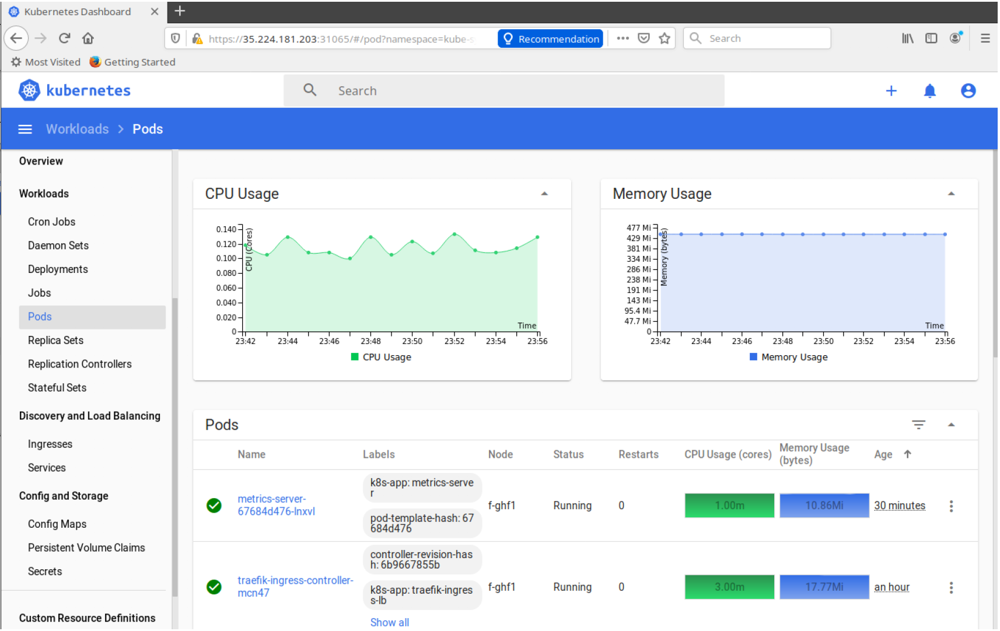

# K8s Lab 11 & 12

This lab is related to Chapter #12 - Logging and Troubleshooting - II (p258)

#### Exercise 13.1: Review Log File Locations
In addition to various logs files and command output, you can use `journalctl` to view logs from the node perspective.
We will view common locations of log files, then a command to view container logs. There are other logging options,
such as the use of a `sidecar` container dedicated to loading the logs of another container in a pod.
Whole cluster logging is not yet available with Kubernetes. Outside software is typically used, such as Fluentd, part of
http://fluentd.org/, which is another member project of CNCF.io, like Kubernetes.

Take a quick look at the following log files and web sites. As server processes move from node level to running in containers
the logging also moves.
1. If using a `systemd`.based Kubernetes cluster, view the node level logs for kubelet, the local Kubernetes agent. Each
node will have different contents as this is node specific.

```
student@master:˜$ journalctl -u kubelet |less
-- Logs begin at Mon 2021-04-26 17:16:09 UTC, end at Fri 2021-04-30 14:34:04 UTC. --
Apr 26 18:52:14 master-73kx systemd[1]: Started kubelet: The Kubernetes Node Agent.
Apr 26 18:52:14 master-73kx systemd[1]: kubelet.service: Current command vanished from the unit file, execution of the command list won't be resumed.
Apr 26 18:52:14 master-73kx systemd[1]: Stopping kubelet: The Kubernetes Node Agent...
Apr 26 18:52:14 master-73kx systemd[1]: Stopped kubelet: The Kubernetes Node Agent.
Apr 26 18:52:14 master-73kx systemd[1]: Started kubelet: The Kubernetes Node Agent.
Apr 26 18:52:15 master-73kx kubelet[18792]: F0426 18:52:15.140426   18792 server.go:198] failed to load Kubelet config file /var/lib/kubelet/config.yaml, error failed to read kubelet config file "/var/lib/kubelet/config.yaml", error: open /var/lib/kubelet/config.yaml: no such file or directory
Apr 26 18:52:15 master-73kx kubelet[18792]: goroutine 1 [running]:
Apr 26 18:52:15 master-73kx kubelet[18792]: k8s.io/kubernetes/vendor/k8s.io/klog/v2.stacks(0xc000122001, 0xc000136840, 0xfb, 0x14d)
Apr 26 18:52:15 master-73kx kubelet[18792]:         /workspace/src/k8s.io/kubernetes/_output/dockerized/go/src/k8s.io/kubernetes/vendor/k8s.io/klog/v2/klog.go:1026 +0xb9
Apr 26 18:52:15 master-73kx kubelet[18792]: k8s.io/kubernetes/vendor/k8s.io/klog/v2.(*loggingT).output(0x70c9460, 0xc000000003, 0x0, 0x0, 0xc0008871f0, 0x6f34162, 0x9, 0xc6, 0x411b00)
...
```

2. Major Kubernetes processes now run in containers. You can view them from the container or the pod perspective. Use
the `find` command to locate the `kube-apiserver` log. Your output will be different, but will be very long.
```
student@master:˜$ sudo find / -name "*apiserver*log"
/var/log/containers/kube-apiserver-master-73kx_kube-system_kube-apiserver-2129910ad4c5e2a819887196c0acb7fc7bcb9f6f1fce97f1fd50419f277ec9e2.log
/var/log/containers/kube-apiserver-master-73kx_kube-system_kube-apiserver-19ace65de2835910b44f06f79d36296fdd38c913d0549ce50f7307c1a90edc03.log
```

3. Take a look at the log file.
```
student@master:˜$ sudo less /var/log/containers/kube-apiserver-master-73kx_kube-system_kube-apiserver-2129910ad4c5e2a819887196c0acb7fc7bcb9f6f1fce97f1fd50419f277ec9e2.log
{"log":"Flag --insecure-port has been deprecated, This flag has no effect now and will be removed in v1.24.\n","stream":"stderr","time":"2021-04-26T18:52:45.196476087Z"}
{"log":"I0426 18:52:45.185832       1 server.go:632] external host was not specified, using 10.128.0.45\n","stream":"stderr","time":"2021-04-26T18:52:45.196521459Z"}
{"log":"I0426 18:52:45.190177       1 server.go:182] Version: v1.20.1\n","stream":"stderr","time":"2021-04-26T18:52:45.196543388Z"}
{"log":"I0426 18:52:46.728118       1 shared_informer.go:240] Waiting for caches to sync for node_authorizer\n","stream":"stderr","time":"2021-04-26T18:52:46.728307371Z"}
{"log":"I0426 18:52:46.729846       1 plugins.go:158] Loaded 12 mutating admission controller(s) successfully in the following order: NamespaceLifecycle,LimitRanger,ServiceAccount,NodeRestriction,TaintNodesByCondition,Priority,DefaultTolerationSeconds,DefaultStorageClass,StorageObjectInUseProtection,RuntimeClass,DefaultIngressClass,MutatingAdmissionWebhook.\n","stream":"stderr","time":"2021-04-26T18:52:46.729964038Z"}
{"log":"I0426 18:52:46.729962       1 plugins.go:161] Loaded 10 validating admission controller(s) successfully in the following order: LimitRanger,ServiceAccount,Priority,PersistentVolumeClaimResize,RuntimeClass,CertificateApproval,CertificateSigning,CertificateSubjectRestriction,ValidatingAdmissionWebhook,ResourceQuota.\n","stream":"stderr","time":"2021-04-26T18:52:46.730056717Z"}
...
```

4. Search for and review other log files for coredns, kube-proxy, and other cluster agents.
```
$ sudo find / -name "*coredns*log"
/var/log/containers/coredns-74ff55c5b-mw5nv_kube-system_coredns-c5676e62013a3cfc6413a837f819c1ba257cc3f75da21f3c1f786224b3beb0ac.log
/var/log/containers/coredns-74ff55c5b-h4v9m_kube-system_coredns-1021c306c2c09f5ca874683e0cdc60ae872c1049135cd149286ced2740f916c2.log
...
$ sudo find / -name "*kube-proxy*log"
/var/log/containers/kube-proxy-dq8v9_kube-system_kube-proxy-b436356f890880b494f4e9369b4b74decac98949c4428c2fc27a76f332109c1c.log
/var/log/containers/kube-proxy-dq8v9_kube-system_kube-proxy-efc81d9762f9d80924070a03f4e7e43d98776172dbf051a09ca7801e01b03218.log
```

5. If **not** on a Kubernetes cluster using systemd which collects logs via journalctl you can view the text files on the master node.
(a) /var/log/kube-apiserver.log
Responsible for serving the API
(b) /var/log/kube-scheduler.log
Responsible for making scheduling decisions
(c) /var/log/kube-controller-manager.log
Controller that manages replication controllers
(d). /var/log/containers
Various container logs
(e). /var/log/pods/
More log files for current Pods.

6. Worker Nodes Files (on non-systemd systems)
(a) /var/log/kubelet.log
Responsible for running containers on the node
(b) /var/log/kube-proxy.log
Responsible for service load balancing

7. More reading: https://kubernetes.io/docs/tasks/debug-application-cluster/debug-service/ and https://kubernetes.io/
docs/tasks/debug-application-cluster/determine-reason-pod-failure/


#### Exercise 13.2: Viewing Logs Output
Container standard out can be seen via the `kubectl logs` command. If there is no standard out, you would not see any
output. In addition, the logs would be destroyed if the container is destroyed.

1. View the current Pods in the cluster. Be sure to view Pods in all namespaces.
```
student@master:˜$ kubectl get po --all-namespaces
NAMESPACE     NAME                                       READY   STATUS    RESTARTS   AGE
default       design2-ddc7b59cb-j7p6t                    1/1     Running   0          2d18h
default       nginx-79f868896b-svbqp                     1/1     Running   1          2d23h
default       registry-6b5bb79c4-ddsqm                   1/1     Running   1          2d23h
kube-system   calico-kube-controllers-69496d8b75-wlnxm   1/1     Running   1          3d19h
kube-system   calico-node-nczzd                          1/1     Running   1          3d19h
kube-system   calico-node-nfs62                          1/1     Running   1          3d19h
kube-system   coredns-74ff55c5b-h4v9m                    1/1     Running   1          3d19h
kube-system   coredns-74ff55c5b-mw5nv                    1/1     Running   1          3d19h
kube-system   etcd-master-73kx                           1/1     Running   1          3d19h
kube-system   kube-apiserver-master-73kx                 1/1     Running   1          3d19h
kube-system   kube-controller-manager-master-73kx        1/1     Running   2          3d19h
kube-system   kube-proxy-bqh7h                           1/1     Running   1          3d19h
kube-system   kube-proxy-dq8v9                           1/1     Running   1          3d19h
kube-system   kube-scheduler-master-73kx                 1/1     Running   1          3d19h
```

2. View the logs associated with various infrastructure pods. Using the Tab key you can get a list and choose a container.
Then you can start typing the name of a pod and use Tab to complete the name.
```
student@master:˜$ kubectl -n kube-system logs <Tab><Tab>
calico-kube-controllers-69496d8b75-wlnxm  kube-apiserver-master-73kx
calico-node-nczzd                         kube-controller-manager-master-73kx
calico-node-nfs62                         kube-proxy-bqh7h
coredns-74ff55c5b-h4v9m                   kube-proxy-dq8v9
coredns-74ff55c5b-mw5nv                   kube-scheduler-master-73kx
etcd-master-73kx
```

```
student@master:˜$ kubectl -n kube-system logs \
kube-apiserver-master
...
I0430 14:39:24.825962       1 clientconn.go:948] ClientConn switching balancer to "pick_first"
I0430 14:40:03.362587       1 client.go:360] parsed scheme: "passthrough"
I0430 14:40:03.362921       1 passthrough.go:48] ccResolverWrapper: sending update to cc: {[{https://127.0.0.1:2379  <nil> 0 <nil>}] <nil> <nil>}
I0430 14:40:03.362980       1 clientconn.go:948] ClientConn switching balancer to "pick_first"
I0430 14:40:45.553406       1 client.go:360] parsed scheme: "passthrough"
I0430 14:40:45.553483       1 passthrough.go:48] ccResolverWrapper: sending update to cc: {[{https://127.0.0.1:2379  <nil> 0 <nil>}] <nil> <nil>}
I0430 14:40:45.553498       1 clientconn.go:948] ClientConn switching balancer to "pick_first"
```


#### Exercise 13.3: Adding tools for monitoring and metrics
With the deprecation of `Heapster` the new, integrated `Metrics Server` has been further developed and deployed. The
`Prometheus` project of CNCF.io has matured from incubation to graduation, is commonly used for collecting metrics,
and should be considered as well.


1. Begin by cloning the software. The git command should be installed already. Install it if not found.
```
student@master:˜$ git clone \
https://github.com/kubernetes-incubator/metrics-server.git
```

2. As the software may have changed it is a good idea to read the README.md file for updated information.
```
student@master:˜$ cd metrics-server/ ; less README.md
Kubernetes Metrics Server

Metrics Server is a scalable, efficient source of container resource metrics for Kubernetes
built-in autoscaling pipelines.

Metrics Server collects resource metrics from Kubelets and exposes them in Kubernetes apiserver through [Metrics API]
for use by [Horizontal Pod Autoscaler] and [Vertical Pod Autoscaler]. Metrics API can also be accessed by `kubectl top`,
making it easier to debug autoscaling pipelines.

Metrics Server is not meant for non-autoscaling purposes. For example, don't use it to forward metrics to monitoring solutions, or as a source of monitoring solution metrics.

Metrics Server offers:
- A single deployment that works on most clusters (see [Requirements](#requirements))
- Scalable support up to 5,000 node clusters
- Resource efficiency: Metrics Server uses 1m core of CPU and 3 MB of memory per node

## Use cases

You can use Metrics Server for:
- CPU/Memory based horizontal autoscaling (learn more about [Horizontal Pod Autoscaler])
- Automatically adjusting/suggesting resources needed by containers (learn more about [Vertical Pod Autoscaler])
...
```

3. Create the necessary objects. Be aware as new versions are released there may be some changes to the process and
the created objects. Use the components.yaml to create the objects. The backslash is not necessary if you type it all on
one line.
```
student@master:˜$ kubectl create -f \
https://github.com/kubernetes-sigs/metrics-server/releases/download/v0.3.7/components.yaml
clusterrole.rbac.authorization.k8s.io/system:aggregated-metrics-reader created
clusterrolebinding.rbac.authorization.k8s.io/metrics-server:system:auth-delegator created
rolebinding.rbac.authorization.k8s.io/metrics-server-auth-reader created
Warning: apiregistration.k8s.io/v1beta1 APIService is deprecated in v1.19+, unavailable in v1.22+; use apiregistration.k8s.io/v1 APIService
apiservice.apiregistration.k8s.io/v1beta1.metrics.k8s.io created
serviceaccount/metrics-server created
deployment.apps/metrics-server created
service/metrics-server created
clusterrole.rbac.authorization.k8s.io/system:metrics-server created
clusterrolebinding.rbac.authorization.k8s.io/system:metrics-server created
```

4. View the current objects, which are created in the kube-system namespace. All should show a Running status.
```
student@master:˜$ kubectl -n kube-system get pods
NAME                                       READY   STATUS    RESTARTS   AGE
calico-kube-controllers-69496d8b75-wlnxm   1/1     Running   1          3d19h
calico-node-nczzd                          1/1     Running   1          3d19h
calico-node-nfs62                          1/1     Running   1          3d19h
coredns-74ff55c5b-h4v9m                    1/1     Running   1          3d19h
coredns-74ff55c5b-mw5nv                    1/1     Running   1          3d19h
etcd-master-73kx                           1/1     Running   1          3d19h
kube-apiserver-master-73kx                 1/1     Running   1          3d19h
kube-controller-manager-master-73kx        1/1     Running   2          3d19h
kube-proxy-bqh7h                           1/1     Running   1          3d19h
kube-proxy-dq8v9                           1/1     Running   1          3d19h
kube-scheduler-master-73kx                 1/1     Running   1          3d19h
metrics-server-68b849498d-kgvnt            1/1     Running   0          29s
```

5. Edit the metrics-server deployment to allow insecure TLS. The default certificate is x509 self-signed and not trusted
by default. In production you may want to configure and replace the certificate. You may encounter other issues as
this software is fast-changing. The need for the kubelet-preferred-address-types line has been reported on some
platforms.
```
student@master:˜$ kubectl -n kube-system edit deployment metrics-server
...
spec:
 containers:
 - args:
  - --cert-dir=/tmp
  - --secure-port=4443
  - --kubelet-insecure-tls #<-- Add this line
  - --kubelet-preferred-address-types=InternalIP,ExternalIP,Hostname #<--May be needed
  image: k8s.gcr.io/metrics-server/metrics-server:v0.3.7
```

6. Test that the metrics server pod is running and does not show errors. At first you should see a few lines showing the
container is listening. As the software changes these messages may be slightly different.
```
student@master:˜$ kubectl -n kube-system logs metrics-server<TAB>
I0430 14:46:43.218399       1 serving.go:312] Generated self-signed cert (/tmp/apiserver.crt, /tmp/apiserver.key)
I0430 14:46:43.748353       1 secure_serving.go:116] Serving securely on [::]:4443
```

7. Test that the metrics working by viewing pod and node metrics. Your output may have different pods. It can take an
minute or so for the metrics to populate and not return an error.
```
student@master:˜$ sleep 120 ; kubectl top pod --all-namespaces
NAMESPACE     NAME                                       CPU(cores)   MEMORY(bytes)
default       design2-ddc7b59cb-j7p6t                    0m           2Mi
default       nginx-79f868896b-svbqp                     0m           2Mi
default       registry-6b5bb79c4-ddsqm                   1m           5Mi
kube-system   calico-kube-controllers-69496d8b75-wlnxm   2m           11Mi
kube-system   calico-node-nczzd                          33m          51Mi
kube-system   calico-node-nfs62                          28m          48Mi
kube-system   coredns-74ff55c5b-h4v9m                    3m           7Mi
kube-system   coredns-74ff55c5b-mw5nv                    3m           8Mi
kube-system   etcd-master-73kx                           14m          28Mi
kube-system   kube-apiserver-master-73kx                 69m          252Mi
kube-system   kube-controller-manager-master-73kx        20m          46Mi
kube-system   kube-proxy-bqh7h                           1m           11Mi
kube-system   kube-proxy-dq8v9                           1m           11Mi
kube-system   kube-scheduler-master-73kx                 4m           17Mi
kube-system   metrics-server-56df6d849-h5l8h             1m           10Mi
```

```
student@master:˜$ kubectl top nodes
NAME          CPU(cores)   CPU%   MEMORY(bytes)   MEMORY%
master-73kx   239m         11%    2379Mi          32%
worker-8f1k   91m          4%     2121Mi          28%
```


##### Configure the Dashboard
While the dashboard looks nice it has not been a common tool in use. Those that could best develop the tool tend to only use
the CLI, so it may lack wanted functionality.

###### Compatibility With Metric Server
The dashboard has not been updated to work with the Metrics Server now that Heapster has been deprecated. While
there is some interest in getting the metrics to show in the dashboard there has been difficulty finding developers to
work on the issue. https://github.com/kubernetes/dashboard/issues/2986


1. Create the dashboard. The short URL in the step below, which has an capital ”oh”, not number zero, is for this longer
URL: https://raw.githubusercontent.com/kubernetes/dashboard/v2.0.0-beta6/aio/deploy/recommended.yaml.

```
kubectl create -f https://bit.ly/2OFQRMy
namespace/kubernetes-dashboard created
serviceaccount/kubernetes-dashboard created
service/kubernetes-dashboard created
secret/kubernetes-dashboard-certs created
secret/kubernetes-dashboard-csrf created
secret/kubernetes-dashboard-key-holder created
configmap/kubernetes-dashboard-settings created
role.rbac.authorization.k8s.io/kubernetes-dashboard created
clusterrole.rbac.authorization.k8s.io/kubernetes-dashboard created
rolebinding.rbac.authorization.k8s.io/kubernetes-dashboard created
clusterrolebinding.rbac.authorization.k8s.io/kubernetes-dashboard created
deployment.apps/kubernetes-dashboard created
service/dashboard-metrics-scraper created
deployment.apps/dashboard-metrics-scraper created
```


2. View the current services in all namespaces. Note that the kubernetes-dashboard is a ClusterIP and part of the
kube-system namespace.
```
student@master:˜$ kubectl get svc --all-namespaces
NAMESPACE              NAME                        TYPE           CLUSTER-IP       EXTERNAL-IP   PORT(S)                  AGE
default                kubernetes                  ClusterIP      10.96.0.1        <none>        443/TCP                  3d19h
default                nginx                       ClusterIP      10.98.38.243     <none>        443/TCP                  2d23h
default                registry                    ClusterIP      10.104.27.122    <none>        5000/TCP                 2d23h
default                secondapp                   LoadBalancer   10.99.35.38      <pending>     80:32000/TCP             19h
kube-system            kube-dns                    ClusterIP      10.96.0.10       <none>        53/UDP,53/TCP,9153/TCP   3d19h
kube-system            metrics-server              ClusterIP      10.103.236.105   <none>        443/TCP                  8m27s
kubernetes-dashboard   dashboard-metrics-scraper   ClusterIP      10.110.245.109   <none>        8000/TCP                 72s
kubernetes-dashboard   kubernetes-dashboard        ClusterIP      10.100.148.189   <none>        443/TCP                  72s
```

3. Edit the kubernetes-dashboard and change the type to a `NodePort`.
```
student@master:˜$ kubectl -n kubernetes-dashboard edit svc kubernetes-dashboard
...
selector:
  k8s-app: kubernetes-dashboard
sessionAffinity: None
type: NodePort #<-- Edit this line
status:
loadBalancer: {}
...
```


4. Check the kubernetes-dashboard service again. The Type should show as NodePort. Take note of the high-numbered port, which is 31107 in the example below.
```
student@master:˜$ kubectl -n kubernetes-dashboard get svc kubernetes-dashboard
NAME                   TYPE       CLUSTER-IP       EXTERNAL-IP   PORT(S)         AGE
kubernetes-dashboard   NodePort   10.100.148.189   <none>        443:31107/TCP   2m54s
```

5. There has been some issues with RBAC and the dashboard permissions to see objects. In order to ensure access to
view various resources give the dashboard admin access.

```
student@master:˜$ kubectl create clusterrolebinding dashaccess \
--clusterrole=cluster-admin \
--serviceaccount=kubernetes-dashboard:kubernetes-dashboard
clusterrolebinding.rbac.authorization.k8s.io/dashaccess created
```

6. On your local node open a browser and navigate to an HTTPS URL made of the Public IP and the high-numbered port: `https://34.72.190.13:31107`
 You will get a message about an insecure connection. Select the Advanced button, then Add Exception..., then
Confirm Security Exception. The page should then show the Kubernetes Dashboard. You may be able to find the
public IP address using curl.
```
student@master:˜$ curl ifconfig.io
34.72.190.13
```


7. We will use the Token method to access the dashboard. With RBAC we need to use the proper token, the
kubernetes-dashboard-token in this case. Find the token, copy it then paste into the login page. The Tab key
can be helpful to complete the secret name instead of finding the hash.
```
student@master:˜$ kubectl -n kubernetes-dashboard describe secrets kubernetes-dashboard-token-<TAB>
Name:         kubernetes-dashboard-token-xrf8l
Namespace:    kubernetes-dashboard
Labels:       <none>
Annotations:  kubernetes.io/service-account.name: kubernetes-dashboard
              kubernetes.io/service-account.uid: a69809d3-8e3a-4eaf-ad20-02503eefdeee
Type:  kubernetes.io/service-account-token
Data
====
ca.crt:     1066 bytes
namespace:  20 bytes
token:      eyJhbGciOiJSUzI1NiIsImtpZCI6ImdoVzBQWnc3ZG8zOUJDSnk5ZVBfM1pDYVBiZ3p0cTVJaTVpLVpFVG9UOUkifQ.eyJpc3MiOiJrdWJlcm5ldGVzL3NlcnZpY2VhY2NvdW50Iiwia3ViZXJuZXRlcy5pby9zZXJ2aWNlYWNjb3VudC9uYW1lc3BhY2UiOiJrdWJlcm5ldGVzLWRhc2hib2FyZCIsImt1YmVybmV0ZXMuaW8vc2VydmljZWFjY291bnQvc2VjcmV0Lm5hbWUiOiJrdWJlcm5ldGVzLWRhc2hib2FyZC10b2tlbi14cmY4bCIsImt1YmVybmV0ZXMuaW8vc2VydmljZWFjY291bnQvc2VydmljZS1hY2NvdW50Lm5hbWUiOiJrdWJlcm5ldGVzLWRhc2hib2FyZCIsImt1YmVybmV0ZXMuaW8vc2VydmljZWFjY291bnQvc2VydmljZS1hY2NvdW50LnVpZCI6ImE2OTgwOWQzLThlM2EtNGVhZi1hZDIwLTAyNTAzZWVmZGVlZSIsInN1YiI6InN5c3RlbTpzZXJ2aWNlYWNjb3VudDprdWJlcm5ldGVzLWRhc2hib2FyZDprdWJlcm5ldGVzLWRhc2hib2FyZCJ9.Fa8jgvZj64ONZYZk4Cs66SU9f3rvGANn4aV1-cz9OcPF9hxrxm6setUt41TywilviSh1jxg7hFVydxZbDARFSoH8Q7T62pHoRIOjYSOOc-kMAZ8tvVrJXOjGEiPo5cE799SzUgn1GbHoR8cPynyzmuLxJ1QW09QlGSTRgtqu1V2nTTmEWIkMB6jStkYoX_uqwqozXgJTxYMcqQmKZ9o6CUDYT5yncDRPzU6Qj2_Q7TZbmlHUiFjCyv22PcyV3YOuIpDN7gX-27-epXqzKhKhs1CNzn8-rHplUZ1Rxka8QW7tZDI8UdheRDvOpYezy7_TFpDzNKFl9TwQusmjdMQrFA
```


8. Navigate around the various sections and use the menu to the left as time allows. As the pod view is of the default
namespace, you may want to switch over to the kube-system namespace or create a new deployment to view the
resources via the GUI. Scale the deployment up and down and watch the responsiveness of the GUI.


